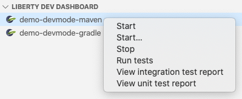
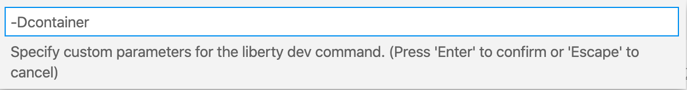
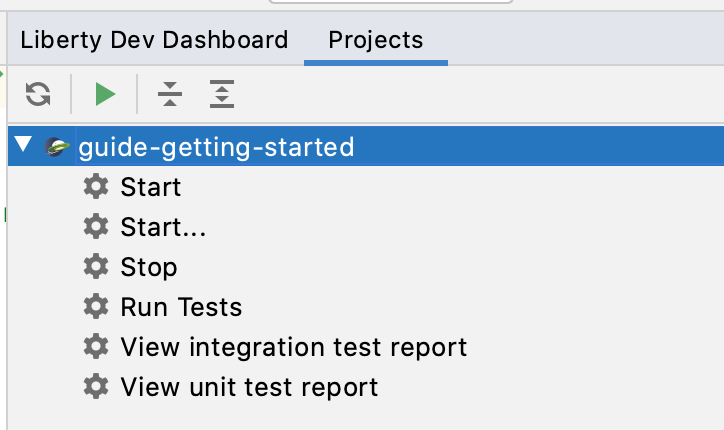
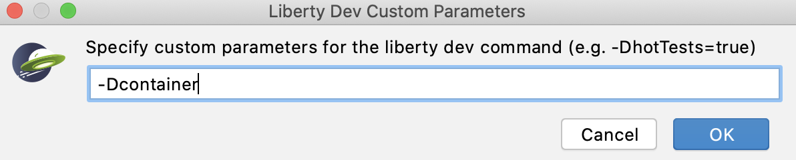

# Liberty dev mode demo with container support

### Quick links
[Maven dev mode for containers documentation](https://github.com/OpenLiberty/ci.maven/blob/master/docs/dev.md#devc-container-mode)  
[Gradle dev mode for containers documentation](https://github.com/OpenLiberty/ci.gradle/blob/master/docs/libertyDev.md#libertydevc-task-container-mode)  
[Open Liberty Tools VS Code extension (optional)](https://marketplace.visualstudio.com/items?itemName=Open-Liberty.liberty-dev-vscode-ext)  
[Open Liberty Tools IntelliJ extension (optional)](https://plugins.jetbrains.com/plugin/14856-open-liberty-tools)

## Demo scenario

### Setup

1. Clone this repository.

2. Notice the [Dockerfile for Maven](Dockerfile) or [Dockerfile for Gradle](DockerfileGradle) in the project directory, which describe the container and can be used for both development and production. This demo focuses on iterative development through Liberty dev mode, which makes use of the Dockerfile to run your server in a container.

### Hot deployment

1. Start dev mode with container support:
    - Maven: `mvn liberty:devc`
    - Gradle: `gradle libertyDevc`

2. Add `mpHealth-3.0` feature to `src/main/liberty/config/server.xml`. You can now access the http://localhost:9080/health endpoint (though it's just an empty array).

<details>
    <summary>3. Create the src/main/java/io/openliberty/sample/system/SystemLivenessCheck.java class.  Changes are reflected in the http://localhost:9080/health endpoint.  </summary>

```java
package io.openliberty.sample.system;

import javax.enterprise.context.ApplicationScoped;

import java.lang.management.MemoryMXBean;
import java.lang.management.ManagementFactory;

import org.eclipse.microprofile.health.Liveness;
import org.eclipse.microprofile.health.HealthCheck;
import org.eclipse.microprofile.health.HealthCheckResponse;

@Liveness
@ApplicationScoped
public class SystemLivenessCheck implements HealthCheck {

    @Override
    public HealthCheckResponse call() {
        MemoryMXBean memBean = ManagementFactory.getMemoryMXBean();
        long memUsed = memBean.getHeapMemoryUsage().getUsed();
        long memMax = memBean.getHeapMemoryUsage().getMax();
  
        return HealthCheckResponse.named(
            SystemResource.class.getSimpleName() + " liveness check")
                                  .withData("memory used", memUsed)
                                  .withData("memory max", memMax)
                                  .status(memUsed < memMax * 0.9).build();
    }
    
}
```
</details>

<details>
    <summary>4. Create the src/main/java/io/openliberty/sample/system/SystemReadinessCheck.java class.  Changes are reflected in the http://localhost:9080/health endpoint. </summary>

```java
package io.openliberty.sample.system;

import javax.enterprise.context.ApplicationScoped;

import javax.inject.Inject;
import javax.inject.Provider;

import org.eclipse.microprofile.config.inject.ConfigProperty;
import org.eclipse.microprofile.health.Readiness;
import org.eclipse.microprofile.health.HealthCheck;
import org.eclipse.microprofile.health.HealthCheckResponse;
import org.eclipse.microprofile.health.HealthCheckResponseBuilder;

@Readiness
@ApplicationScoped
public class SystemReadinessCheck implements HealthCheck {

    @Inject
    @ConfigProperty(name = "io_openliberty_guides_system_inMaintenance")
    Provider<String> inMaintenance;
	
    @Override
    public HealthCheckResponse call() {
        HealthCheckResponseBuilder builder = HealthCheckResponse.named(
		SystemResource.class.getSimpleName() + " readiness check");
        if (inMaintenance != null && inMaintenance.get().equalsIgnoreCase("true")) {
            return builder.withData("services", "not available").down().build();
        }
        return builder.withData("services", "available").up().build();
    }
    
}
```
</details>

5. Change the `io_openliberty_guides_system_inMaintenance` variable in `src/main/liberty/config/server.xml` to `true`.  Changes are reflected in the http://localhost:9080/health endpoint.  Undo this afterwards.

6. Make changes to the `src/main/webapp/index.html` (or any other webapp files). Changes are reflected on the home page http://localhost:9080/.

### Hot testing

1. Go to the console where you started dev mode, and press Enter.  The integration tests are run on a separate thread while dev mode is still active.

<details>
    <summary>2. Create the src/test/java/it/io/openliberty/sample/HealthEndpointIT.java class as an integration test. Notice the "liberty.hostname" and "liberty.http.port" system properties which are provided by dev mode when running integration tests. Press Enter in the console to run the tests. They should pass. </summary>
    
```java
package it.io.openliberty.sample;

import static org.junit.Assert.assertEquals;

import javax.json.JsonObject;
import javax.ws.rs.client.Client;
import javax.ws.rs.client.ClientBuilder;
import javax.ws.rs.core.Response;

import org.apache.cxf.jaxrs.provider.jsrjsonp.JsrJsonpProvider;
import org.junit.After;
import org.junit.Before;
import org.junit.BeforeClass;
import org.junit.Test;

public class HealthEndpointIT {
    
    private static String baseUrl;
    private static final String HEALTH_ENDPOINT = "/health";
    private static final String LIVENESS_ENDPOINT = "/health/live";
    private static final String READINESS_ENDPOINT = "/health/ready";
    
    private Client client;
    private Response response;
    
    @BeforeClass
    public static void oneTimeSetup() {
        String hostname = System.getProperty("liberty.hostname", "localhost");
        String port = System.getProperty("liberty.http.port", "9080");
        baseUrl = "http://" + hostname + ":" + port + "/";
    }
    
    @Before
    public void setup() {
        response = null;
        client = ClientBuilder.newClient();
        client.register(JsrJsonpProvider.class);
    }
    
    @After
    public void teardown() {
        response.close();
        client.close();
    }

    @Test
    public void testHealthEndpoint() {
        String healthURL = baseUrl + HEALTH_ENDPOINT;
        response = this.getResponse(baseUrl + HEALTH_ENDPOINT);
        this.assertResponse(healthURL, response);
        
        JsonObject healthJson = response.readEntity(JsonObject.class);
        String expectedOutcome = "UP";
        String actualOutcome = healthJson.getString("status");
        assertEquals("Application should be healthy", expectedOutcome, actualOutcome);
       
        JsonObject healthCheck = healthJson.getJsonArray("checks").getJsonObject(0);
        String healthCheckName = healthCheck.getString("name");
        actualOutcome = healthCheck.getString("status");
        assertEquals(healthCheckName + " wasn't healthy", expectedOutcome, actualOutcome);

        healthCheck = healthJson.getJsonArray("checks").getJsonObject(1);
        healthCheckName = healthCheck.getString("name");
        actualOutcome = healthCheck.getString("status");
        assertEquals(healthCheckName + " wasn't healthy", expectedOutcome, actualOutcome);
    }

    @Test
    public void testLivenessEndpoint() {
        String livenessURL = baseUrl + LIVENESS_ENDPOINT;
        response = this.getResponse(baseUrl + LIVENESS_ENDPOINT);
        this.assertResponse(livenessURL, response);
        
        JsonObject healthJson = response.readEntity(JsonObject.class);
        String expectedOutcome = "UP";
        String actualOutcome = healthJson.getString("status");
        assertEquals("Applications liveness check passed", expectedOutcome, actualOutcome);
    }

    @Test
    public void testReadinessEndpoint() {
        String readinessURL = baseUrl + READINESS_ENDPOINT;
        response = this.getResponse(baseUrl + READINESS_ENDPOINT);
        this.assertResponse(readinessURL, response);
        
        JsonObject healthJson = response.readEntity(JsonObject.class);
        String expectedOutcome = "UP";
        String actualOutcome = healthJson.getString("status");
        assertEquals("Applications readiness check passed", expectedOutcome, actualOutcome);
    }
   
    private Response getResponse(String url) {
        return client.target(url).request().get();
    }

    private void assertResponse(String url, Response response) {
        assertEquals("Incorrect response code from " + url, 200, response.getStatus());
    }

}
```
</details>

3. Stop dev mode by pressing Ctrl-C in the console.

4. Run dev mode with container support and hot testing enabled.
    - Maven: `mvn liberty:devc -DhotTests`
    - Gradle: `gradle libertyDevc --hotTests`

5. Notice tests are run immediately after dev mode starts up.

6. In `src/main/java/io/openliberty/sample/system/SystemResource.java`, change the annotation `@Path("/properties")` to `@Path("/properties2")`.

7. Notice tests are run automatically after the source change, and a test fails because the endpoint path is wrong.

8. Revert the annotation back to `@Path("/properties")`.

9. Notice tests are run automatically and pass.

### Hot debugging

1. In `src/main/java/io/openliberty/sample/system/SystemLivenessCheck.java`, set a breakpoint inside the `call()` method.

2. Attach your IDE's debugger to port `7777`.  
For example, in VS Code, click `Debug` > `Add Configuration...` > `Java: Attach` > set `"port": "7777"`.  Then `View` > `Debug` > select `Debug (Attach)`, then press the arrow icon to start debugging.

3. In your browser, go to http://localhost:9080/health.

4. Notice your IDE pauses at the breakpoint that you set, allowing you to debug.

5. Disconnect the debugger.

6. When you are done, press Ctrl-C in the console to terminate dev mode and stop your server.

## VS Code extension

The [Open Liberty Tools for VS Code](https://marketplace.visualstudio.com/items?itemName=Open-Liberty.liberty-dev-vscode-ext) extension is an IDE specific extension that lets you interact with dev mode through menu options as an alternative to using the console.

1. In VS Code, go to the Extensions view (`View` > `Extensions`).

2. Search for `Open Liberty Tools`.

3. Click `Install`.

4. Go to the Explorer view (`View` > `Explorer`).

5. In the side bar, `Liberty Dev Dashboard` shows your Liberty dev projects.

6. Right-click your project, choose `Start...`

7. Enter `-Dcontainer` (if using Maven) or `--container` (if using Gradle) as a parameter to start dev mode with container support.

8. Use the other options on the `Liberty Dev Dashboard` to further interact with dev mode, such as to run tests or to stop the server.





## IntelliJ extension

The [Open Liberty Tools for IntelliJ](https://plugins.jetbrains.com/plugin/14856-open-liberty-tools) extension is an IDE specific extension lets you interact with dev mode through menu options as an alternative to using the console.

1. In IntelliJ, go to the Plugins Marketplace (`Settings` > `Plugins` > `Marketplace`).

2. Search for `Open Liberty Tools`.

3. Click `Install`.

4. In the right side bar, `Liberty Dev Dashboard` shows your Liberty dev projects.

5. Right-click your project, choose `Start...`. You can also select `Start...` from the drop-down list below your project name.

6. Enter `-Dcontainer` (if using Maven) or `--container` (if using Gradle) as a parameter to start dev mode with container support.

7. Use the other options on the `Liberty Dev Dashboard` to further interact with dev mode, such as to run tests or to stop the server.



